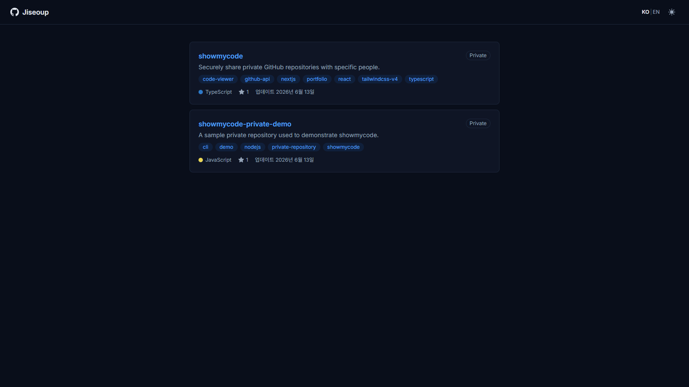

<div align="center">
  
  <h1>showmycode</h1>
  <p>
    <b>English</b> | <a href="README.ko.md">한국어</a>
  </p>
</div>

Share private GitHub repositories securely — without exposing your credentials.

**showmycode** is a self-hosted code viewer that lets you grant read-only access to specific private repositories.  
Share a single link with interviewers, collaborators, or reviewers, and they can browse your code, commits, and pull requests — all without needing a GitHub account or your PAT.

**[Live Demo](https://showmycode.vercel.app)**



## ✨ Features

- 📂 **Code Viewer** — File tree browser with syntax highlighting (20+ languages via Shiki)
- 📜 **Commit History** — Paginated commit list with detailed diff view per commit
- 🔀 **Pull Requests** — PR list with overview, commits, and files changed tabs
- 🌿 **Branch Selector** — Switch between branches to browse different code states
- 🌙 **Dark Mode** — Toggle between light and dark themes
- 🌐 **i18n** — Korean and English interface
- 📱 **Mobile Friendly** — Fully responsive layout down to 320px
- 🔐 **Access Control** — Optional share token with HMAC-SHA256 cookie authentication
- 🛡️ **Zero Credential Exposure** — GitHub PAT stays server-side; viewers never see it

## 🚀 Deploy Your Own

[](https://vercel.com/new/clone?repository-url=https://github.com/Jiseoup/showmycode&env=GITHUB_PAT,GITHUB_OWNER,GITHUB_REPOS,SHARE_TOKEN&envDescription=Required%20environment%20variables&envLink=https://github.com/Jiseoup/showmycode#environment-setup)

Click the button above to clone this repository and deploy it to Vercel in one step.  
You will be prompted to fill in the required environment variables.

## ⚙️ Environment Setup

Copy `.env.example` to `.env.local` and fill in the values:

```bash
cp .env.example .env.local
```

| Variable           | Description                                                   | Required | Default |
| ------------------ | ------------------------------------------------------------- | -------- | ------- |
| `GITHUB_PAT`       | Fine-grained GitHub personal access token (read-only)         | Yes      | —       |
| `GITHUB_OWNER`     | GitHub username or organization                               | Yes      | —       |
| `GITHUB_REPOS`     | Comma-separated repository names to expose                    | Yes      | —       |
| `FILE_TREE_DEPTH`  | File tree default expansion depth (`0` = all collapsed)       | No       | `0`     |
| `COMMITS_PER_PAGE` | Commits per page (max `100`)                                  | No       | `20`    |
| `PULLS_PER_PAGE`   | Pull requests per page (max `100`)                            | No       | `10`    |
| `SHARE_TOKEN`      | Access token for the share link (leave empty for public mode) | No       | —       |

### 🔑 Creating a GitHub PAT

1. Go to [GitHub Settings > Fine-grained tokens](https://github.com/settings/personal-access-tokens)
2. Click **Generate new token**
3. Under **Repository access**, select only the repos you want to share
4. Set permissions:
   - **Contents** — Read-only
   - **Pull requests** — Read-only
5. Copy the generated token into `GITHUB_PAT`

> **Warning:** Never commit your PAT. `.env.local` is included in `.gitignore`.

## 🔒 Access Control

showmycode supports two modes depending on whether `SHARE_TOKEN` is set:

### Public Mode (no `SHARE_TOKEN`)

All pages are accessible without authentication. Ideal for demo sites or open portfolios.

### Token Mode (with `SHARE_TOKEN`)

All pages require authentication. There are two ways to authenticate:

1. **Share link** — Append `?token=<SHARE_TOKEN>` to any URL. The token is validated, a secure cookie is set, and the visitor is redirected without the token in the URL.

   ```
   https://your-domain.com/?token=your-secret-token
   ```

2. **Manual entry** — Visitors without a valid token are redirected to a token entry page where they can paste the token.

Once authenticated, a 30-day `httpOnly` cookie keeps the session active.  
The cookie stores an HMAC-SHA256 digest — not the raw token — so a leaked cookie does not reveal the share token.

## 🏁 Getting Started

```bash
git clone https://github.com/Jiseoup/showmycode.git
cd showmycode
npm install
cp .env.example .env.local  # fill in your values
npm run dev
```

Open [http://localhost:3000](http://localhost:3000) to see the app.

### Available Scripts

```bash
npm run dev             # Start development server
npm run build           # Production build
npm run start           # Start production server
npm run lint            # Run ESLint
npm run lint:fix        # Run ESLint with --fix
npm run format          # Run Prettier (includes Tailwind class sort)
npm run format:check    # Check formatting (used in CI)
npm run typecheck       # Run tsc --noEmit
```

## 🛠️ Tech Stack

- [Next.js 16](https://nextjs.org/) (App Router, React 19)
- [TypeScript](https://www.typescriptlang.org/)
- [Tailwind CSS v4](https://tailwindcss.com/)
- [shadcn/ui](https://ui.shadcn.com/)
- [Shiki](https://shiki.style/) (syntax highlighting)
- [react-markdown](https://github.com/remarkjs/react-markdown) + [remark-gfm](https://github.com/remarkjs/remark-gfm)
- [Vercel](https://vercel.com/) (deployment)

## 🔍 How It Works

```
Viewer → showmycode (Server Components) → GitHub API (with PAT)
```

All GitHub API calls happen server-side. The PAT never reaches the browser.  
Repository access is restricted to the repos listed in `GITHUB_REPOS` — any unlisted repo returns a 404.

GitHub responses are cached for 60 seconds, so data shown to viewers may be up to one minute stale.

## 🤝 Contributing

Contributions are welcome! Please see [CONTRIBUTING.md](CONTRIBUTING.md) for guidelines on branching, commit messages, and the PR process.

## 📄 License

[MIT](LICENSE) © 2026 JISUB LIM
